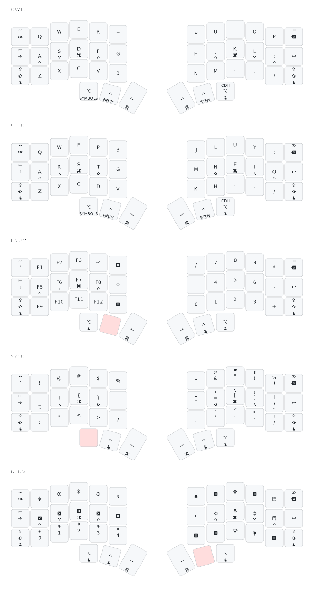

# jinius's zmk-config

Personal [ZMK firmware](https://github.com/zmkfirmware/zmk/) configuration repo for my 42-keys corne keyboard.

I use this for my work and personal Mac and my Old Windows laptop revitalized using Linux Mint. 

---

> [!WARNING]\
> Under **_active development_**. Items to be added are highlighted under **Tasks**

> [!NOTE]\
> This layout is primarily designed for learning **[Colemak-DH](https://colemakmods.github.io/mod-dh/)** to help me migrate from **QWERTY** layout, where I have built my muscle memory.
> 

---
## Hightligh [v2.2.0]
- Switched to [Momentary Layers](https://zmk.dev/docs/behaviors/layers#momentary-layer) from [Toggle Layer](https://zmk.dev/docs/behaviors/layers#toggle-layer)
- Updated the [Timeless homerow mods](https://github.com/urob/zmk-config#timeless-homerow-mods) and removed the `hold-trigger-on-release` configuration as it is not working for me yet (Because of my low WPM speed).
- Added the stand-alone Shift key in the Function/Number layer, which I use it with [IntelliJ Idea](https://www.jetbrains.com/idea/)
- Updating the documentation
  - Added the [Caps Word](https://zmk.dev/docs/behaviors/caps-word) in v2.0.0
- Cleanup the commented code from the keymap config file
- Updated the keymap svg file with the changes

## Highlight [v2.1.0]
- Added the keyboard layout svg using [Keymap Drawer](https://github.com/caksoylar/keymap-drawer)
- Used the default keymap drawer config as explained

## Highlight [v2.0.0]
- Layers as mentioned by [Miryoku ZMK](https://github.com/manna-harbour/miryoku_zmk)
- Prefer [Toggle Layer](https://zmk.dev/docs/behaviors/layers#toggle-layer) along with [Tap Dance](https://zmk.dev/docs/behaviors/tap-dance) to work on a layer
- Switching between Mac & Win as mentioned [How To Mimic QMK’s CG_TOGG or AG_TOGG OS Key Switching Behavior In ZMK](https://flatfootfox.com/how-to-mimic-qmks-cg_togg-or-ag_togg-os-key-switching-behavior-in-zmk/)
- Home Row Mods setup for trial as mentioned [A guide to home row mods](https://precondition.github.io/home-row-mods)
- Trial of [Timeless homerow mods](https://github.com/urob/zmk-config#timeless-homerow-mods)
- Preference to [&none](https://zmk.dev/docs/behaviors/misc#none) instead of [&trans](https://zmk.dev/docs/behaviors/misc#transparent)

## Highlight [v1.0.0]
- Default set-up as provided by intial zmk firmware setup

## Items for next release
- Urob's [zmk-nodefree-config](https://github.com/urob/zmk-nodefree-config) to add functionality
- Enable local and github action build for all the release versions
- ~~Use [Caps Word](https://zmk.dev/docs/behaviors/caps-word) in place of <kbd>Caps Lock</kbd>~~ [v2.0.0](README.md#highlight-v200).
- Configure [mouse keys on the host](https://en.wikipedia.org/wiki/Mouse_keys) by following the steps mentioned at [Miryoku ZMK](https://github.com/manna-harbour/miryoku_zmk#mouse-keys)
- Provide a keymap image file using one of these options (or may be all of them): ~~[keymap-drawer](https://github.com/caksoylar/keymap-drawer)~~ [v2.1.0](README.md#highlight-v210), [Keymap Editor](https://github.com/nickcoutsos/keymap-editor#keymap-editor)
- Register the repo with [KeymapDB](https://keymapdb.com/) at some point in time
- Update the keymap image file with more details similar to [minusfive](https://github.com/minusfive/zmk-config/tree/main) keymap_drawer config file

## References
- My journey towards using split keyboard, specifically corne with nice!nano v2.0, was inspired by [Josean Martinez](https://www.josean.com/) and his video about the keyboard (https://youtu.be/wTMcH7u-vu0?si=mLIXluwT_KchNSwd)
- My keboard source: [Typeractive](https://typeractive.xyz/)
- [ZMK Firmware GitHub](https://github.com/zmkfirmware/zmk)
- [ZMK Documentation](https://zmk.dev/docs)
- Various config repos collected @[KeymapDB](https://keymapdb.com/)
  - [Knucklehead](https://github.com/minusfive/zmk-config)
  - [Miryoku ZMK](https://github.com/manna-harbour/miryoku_zmk)
  - [caksoylar](https://github.com/caksoylar/zmk-config)
  - [urob](https://github.com/urob/zmk-config)
  - More to be added as I go add more features to my current config

